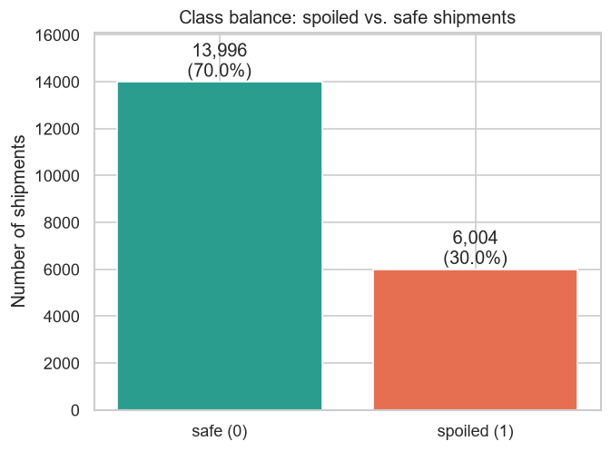
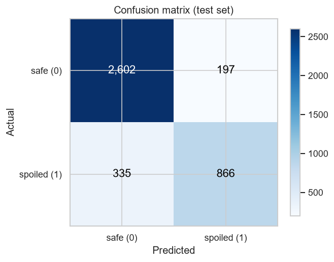
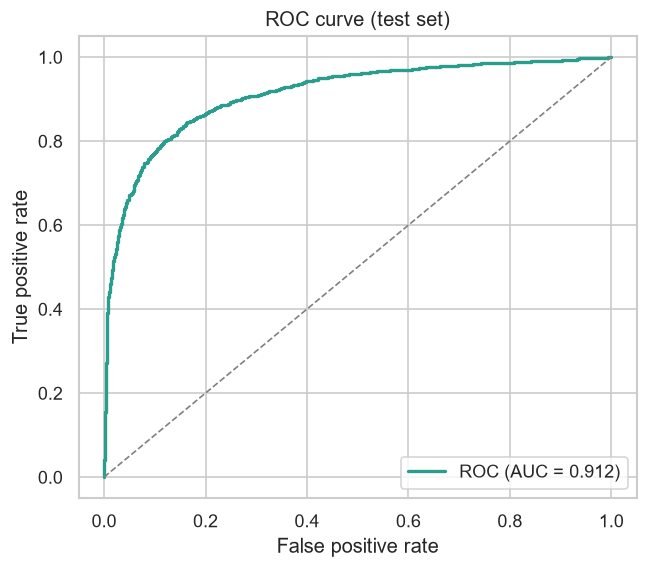
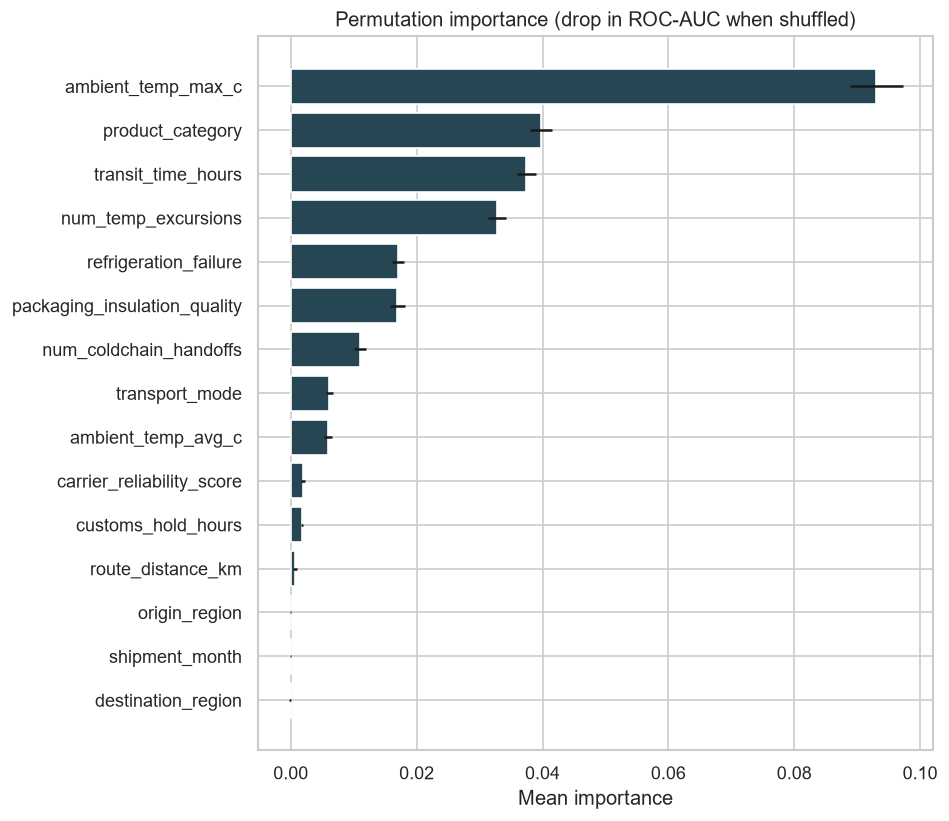
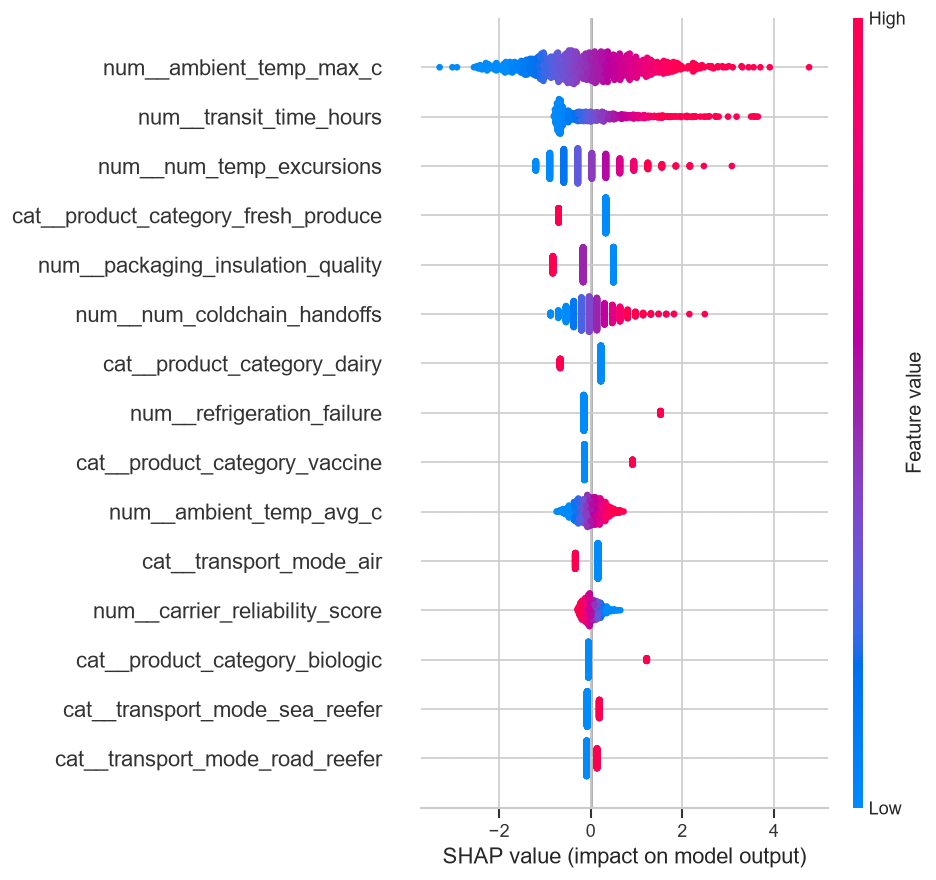
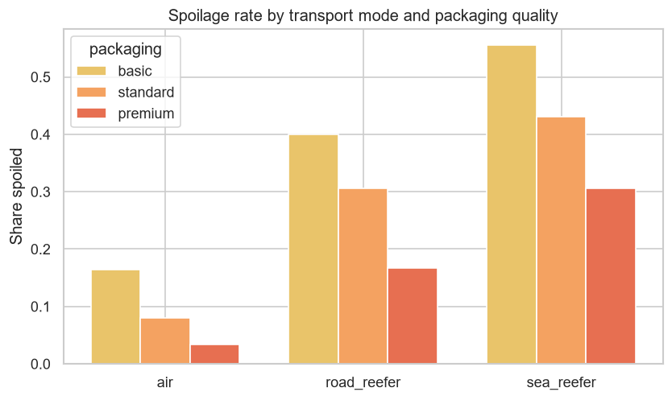

# ColdChain Guardian 🧊🚢

**Predicting spoilage risk in cross-border perishable & pharmaceutical shipments — before they depart.**


ColdChain Guardian is an end-to-end machine-learning project that estimates the probability a temperature-sensitive international shipment arrives **spoiled or out of temperature spec**, using only the information known *before departure*. That early-warning signal lets an exporter intervene while it still matters — upgrade packaging, switch to a faster mode, pick a more reliable carrier, or re-route around a heat wave.

> ⚠️ **Data disclosure:** This project runs on a **realistic, domain-based *simulation*** of ~20,000 shipments — **not** real operational data. The generator encodes sensible cold-chain physics (thermal stress, excursions, mode/packaging effects) plus deliberate noise and *unobserved* factors so the task behaves like a real, noisy prediction problem. See [Data](#-data).

---

## 📦 Problem & business context

Perishable foods (fresh produce, dairy, seafood, frozen goods) and temperature-sensitive pharmaceuticals (vaccines, biologics) lose enormous value when the **cold chain** breaks in transit. Industry estimates routinely put cold-chain losses in the **double-digit percentages** of shipped volume, and a single spoiled pharma container can be worth six or seven figures. For exporters and international-trade operators, spoilage is simultaneously a **financial**, **regulatory**, and **reputational** risk.

The hard part: once a shipment is *en route*, options shrink fast. The value is in acting **before departure**, when the lane, mode, packaging, and carrier can still be changed. ColdChain Guardian frames exactly that decision as a supervised learning problem:

- **Primary task — binary classification:** will this shipment arrive `spoiled` (1) or `safe` (0)?
- **Bonus task — regression:** predict the **shelf-life / quality score remaining at delivery** (0–100).

---

## 🧪 Data

The dataset is a **domain-based simulation** of **20,000 shipments** (random seed `42`, fully reproducible). Each shipment's outcome is built from *cumulative thermal stress* — longer transit, hotter ambient temperatures, more temperature excursions, more handoffs, weaker packaging and refrigeration failures all push risk up, while premium packaging, air freight and reliable carriers pull it down. Different product categories carry different intrinsic sensitivity, and the **best transport mode genuinely differs by product** (frozen cargo rides a sea reefer well but suffers on long road hauls; fresh produce rots at sea yet is fine by air).

To keep the task honest and non-trivial, the generator injects:

- **Two *unobserved* drivers** (crew handling quality and sensor-calibration drift) that affect the outcome but are **never exposed as features** — creating irreducible uncertainty.
- **Gaussian noise** on the latent risk score, and **~3% label flips** (mis-recorded outcomes).

The result is a genuinely learnable but *imperfect* problem: the best models reach **ROC-AUC ≈ 0.91**, not a leaky ~100%. Roughly **30%** of shipments spoil.

### Feature dictionary

| Feature | Type | Description |
|---|---|---|
| `product_category` | categorical | fresh_produce, dairy, seafood, frozen, vaccine, biologic |
| `origin_region` / `destination_region` | categorical | 8 world regions, each with a climate (ambient-temperature) profile |
| `transport_mode` | categorical | air, road_reefer, sea_reefer |
| `packaging_insulation_quality` | ordinal | 0 = basic, 1 = standard, 2 = premium |
| `transit_time_hours` | numeric | end-to-end transit duration |
| `route_distance_km` | numeric | shipping distance |
| `num_coldchain_handoffs` | numeric | number of custody/temperature handoffs |
| `ambient_temp_avg_c` / `ambient_temp_max_c` | numeric | average / peak ambient temperature along the route |
| `num_temp_excursions` | numeric | times the container left its safe temperature band |
| `refrigeration_failure` | binary | whether a refrigeration unit failed in transit |
| `carrier_reliability_score` | numeric | carrier track record, 0–1 |
| `customs_hold_hours` | numeric | time held at customs |
| `shipment_month` | numeric | month 1–12 (captures seasonality) |
| **`spoiled`** | **target** | **1 = spoiled / out of spec, 0 = safe** |
| **`shelf_life_remaining`** | **target** | **bonus regression target, 0–100** |

A small, human-readable slice is committed at [`data/sample_shipments.csv`](data/sample_shipments.csv); the full dataset is regenerated deterministically by the pipeline.

### Class balance



---

## 🔬 Approach / methodology

```
generate data → EDA → preprocessing → model comparison → tuning → evaluation → explainability
```

1. **EDA** — class balance, feature distributions by outcome, a correlation matrix, and domain cuts such as spoilage rate by product category and by transport mode × packaging.
2. **Preprocessing** — a scikit-learn `Pipeline` + `ColumnTransformer` that one-hot-encodes categoricals and standardizes numerics. The preprocessor lives **inside** the pipeline and is fit **only on training folds**, so there is **no data leakage**.
3. **Validation design** — a stratified **60 / 20 / 20** train / validation / test split, plus **5-fold stratified cross-validation** for model selection.
4. **Model comparison** — three families on equal footing: **Logistic Regression** (baseline), **Random Forest**, and **gradient boosting** (LightGBM, with automatic fallback to XGBoost and then scikit-learn's `HistGradientBoostingClassifier`, so a missing optional package never breaks the run).
5. **Hyperparameter tuning** — `RandomizedSearchCV` on the best model, optimizing cross-validated ROC-AUC.
6. **Evaluation** — accuracy, precision, recall, F1 and ROC-AUC, plus confusion matrix, ROC curve and precision-recall curve on the held-out test set.
7. **Explainability** — model-agnostic **permutation importance** and a **SHAP** summary.
8. **Bonus regression** — a `HistGradientBoostingRegressor` for shelf-life remaining, scored with MAE / RMSE / R².

---

## 📊 Results

**Model comparison** (5-fold cross-validated ROC-AUC on the training set):

| Model | CV ROC-AUC | |
|---|---|---|
| **Logistic Regression** | **0.914 ± 0.005** | ✅ selected (tuned `C = 0.1`) |
| LightGBM | 0.914 ± 0.004 | statistically tied |
| Random Forest | 0.907 ± 0.003 | |

A notable, honest finding: after proper preprocessing, a **well-regularized logistic regression matched the gradient-boosted trees** (all three within ~0.7% AUC). It was selected as the production model for its **speed, stability and interpretability** — a reminder that a heavier model isn't always the better choice.

**Held-out test-set performance** (chosen model):

| Metric | Score |
|---|---|
| ROC-AUC | **0.912** |
| Accuracy | **0.867** |
| Precision | 0.815 |
| Recall | 0.721 |
| F1 | 0.765 |

**Bonus — shelf-life regression:** MAE **11.7**, RMSE **16.2**, R² **0.854**.

<table>
<tr>
<td></td>
<td></td>
</tr>
<tr>
<td></td>
<td></td>
</tr>
</table>

---

## 💡 Key insights

- **Heat dominates.** Peak ambient temperature along the route (`ambient_temp_max_c`) is the single strongest driver of spoilage — consistent with the physics of thermal stress.
- **Time and handling compound it.** Long `transit_time_hours`, more `num_temp_excursions` and more `num_coldchain_handoffs` steadily raise risk, and heat *compounds* on long journeys (an interaction, not just additive).
- **Product sensitivity is real.** Vaccines and biologics face a steep cliff — they tolerate almost no abuse — while fresh produce is comparatively hardy.
- **The right mode depends on the cargo.** Air freight is protective for most goods, but the *best* mode varies by product; mode-product mismatch is a leading risk factor.
- **Controllable levers matter.** Premium packaging and high carrier reliability measurably reduce risk — exactly the knobs an exporter can turn before departure.



---

## 🚀 How to run

Requires **Python 3.11+** (developed and tested on 3.14).

```bash
# 1. Clone and enter the project
git clone https://github.com/<your-username>/coldchain-guardian.git
cd coldchain-guardian

# 2. Create and activate a virtual environment
python -m venv .venv
# Windows:
.venv\Scripts\activate
# macOS / Linux:
source .venv/bin/activate

# 3. Install dependencies
pip install -r requirements.txt

# 4. Run the entire pipeline end-to-end
#    (generates data → EDA → trains/tunes/compares → evaluates → saves figures & model)
python run.py

# 5. Score a few example shipments with the saved model
python src/predict.py

# 6. (optional) run the smoke tests
pytest
```

The full pipeline runs in well under a minute on a laptop. All outputs land in `data/`, `figures/` and `models/`.

---

## 🗂️ Project structure

```
coldchain-guardian/
├── README.md
├── requirements.txt          # pinned dependencies
├── LICENSE                   # MIT
├── .gitignore
├── run.py                    # runs the whole pipeline end-to-end
├── src/
│   ├── config.py             # seed, paths, domain constants
│   ├── generate_data.py      # creates the synthetic dataset
│   ├── eda.py                # saves EDA figures
│   ├── features.py           # preprocessing pipeline + train/val/test split
│   ├── train.py              # compares, tunes and saves the best model
│   ├── evaluate.py           # metrics, confusion matrix, ROC/PR, importance, SHAP
│   └── predict.py            # loads the saved model, scores sample shipments
├── data/
│   └── sample_shipments.csv  # small committed sample (full set is generated)
├── figures/                  # all generated plots
├── models/                   # saved model artifacts + metrics.json
└── tests/
    └── test_pipeline.py      # pytest smoke tests
```

---

## ⚠️ Limitations & future work

- **Synthetic data.** The dataset is a domain-based *simulation*. The modeling methodology is real and transferable, but the specific coefficients and numbers are not drawn from real operations. The natural next step is to validate on genuine shipment + IoT temperature-logger data.
- **Richer signals.** Real deployments would add time-series temperature traces, GPS/weather feeds, lane-level historical loss rates, and carrier-specific records — likely pushing performance beyond this synthetic ceiling and giving the tree models more interactions to exploit.
- **Calibration & thresholds.** For operational use, predicted probabilities should be calibrated and the decision threshold tuned to the real cost asymmetry between a missed spoilage and a false alarm.
- **Deployment.** A lightweight REST API (FastAPI) or a Streamlit dashboard could serve risk scores at booking time; the saved `joblib` pipeline is already self-contained and ready to wrap.

---

## 🛠️ Tech stack

**Python** · **pandas** / **NumPy** (data) · **scikit-learn** (pipelines, models, tuning, metrics) · **LightGBM** (gradient boosting) · **SHAP** + permutation importance (explainability) · **matplotlib** / **seaborn** (visualization) · **pytest** (tests) · **joblib** (model persistence).

---

<sub>MIT licensed. Built as an end-to-end ML portfolio project; the data is a domain-based simulation, disclosed as such throughout.</sub>
